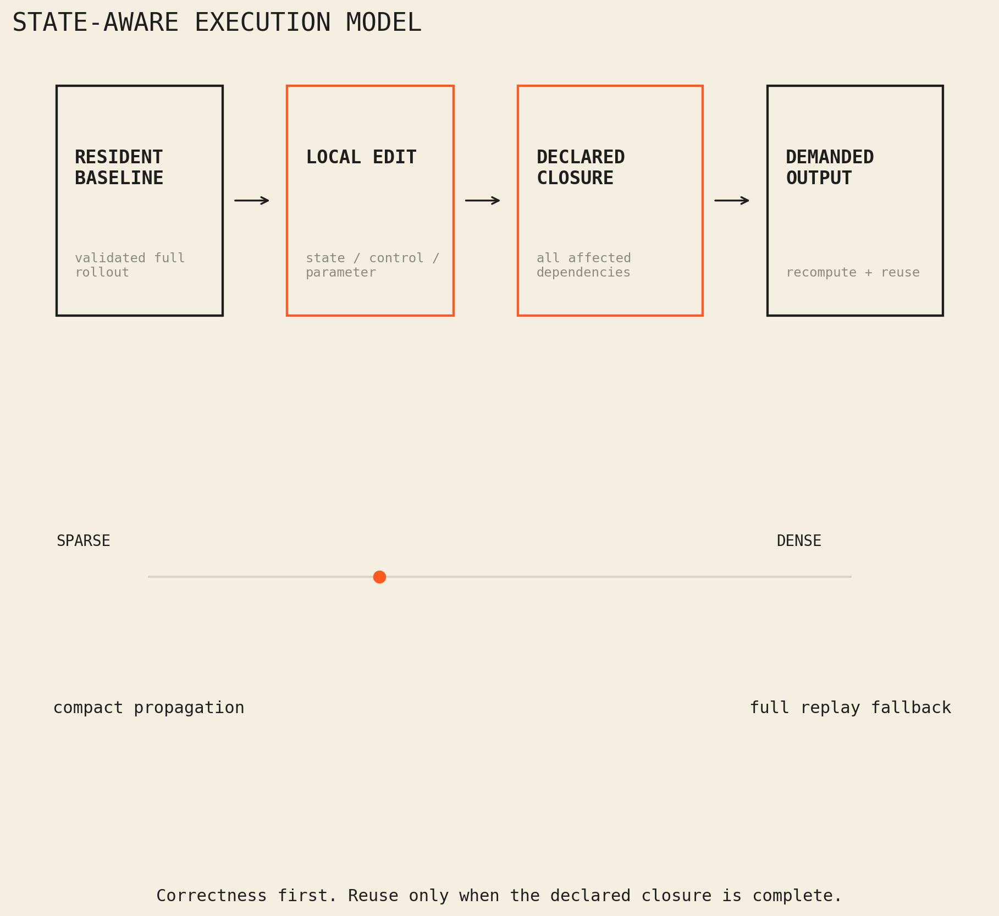
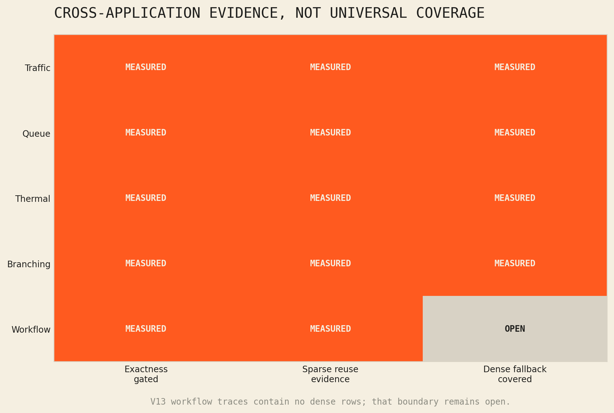

# Abstract

State-Space Programming Methodology (SSPM) is a restricted state-transition
runtime for repeated interventions on a shared system. It keeps a validated
baseline state resident, edits a local target, propagates the complete declared
dependency closure, and reuses unaffected values. If locality disappears, the
runtime falls back to full replay. Under sufficient-state and complete-dependency
conditions, compact execution is consistent with from-scratch execution. Across
traffic, queue, thermal, branching, and workflow families, sparse closures often
reduced local CPU decision cost; dense, cold, and materialization-heavy regimes
did not. A fair cross-project control later reproduced the same adaptive
transition work. The result is a bounded execution and state-organization
mechanism, not representation-level causality, universal linearization, or
universal speed.

# 1. Transition semantics

Let `x_t` be sufficient declared state, `u_t` the exogenous input, and `F` the
ordered transition:

$$x_{t+1}=F(x_t,u_t).$$

A from-scratch rollout produces a baseline trajectory `X^0`. An intervention
changes a subset of state, controls, or parameters. SSPM computes the transitive
affected closure `C_t` induced by declared reads, writes, ordering, and coupling.
At each step, values in `C_t` are recomputed and values outside it are reused
from `X^0`. A demanded output is reconstructed from both regions.

**Conditional exactness.** Compact execution equals full replay if state is
sufficient; all dependencies are declared; the closure contains every value
reachable from the edit; reused values share transition semantics, parameters,
and exogenous inputs; and output reconstruction is complete. An omitted
dependency or hidden side effect breaks the premise. Full replay is therefore a
correctness-preserving runtime path, not merely a performance baseline.

A complete proof models the rollout as a time-expanded dependency graph and
uses topological induction to establish unaffected-node invariance and
recomputed-node equality. See [Formal Semantics and Conditional Exactness of
State-Aware Transition Reuse](FORMAL_SEMANTICS_AND_CONDITIONAL_EXACTNESS.md).

{width=64%}

\thispagestyle{fancy}

# 2. Mechanism and novelty boundary

The mechanism is designed for repeated "what changes if this changes?" queries.
One baseline is computed and retained. Each candidate intervention pays for
closure discovery, compact propagation, and required materialization rather
than rebuilding and replaying the entire system. Its useful region is:

$$T_{closure}+T_{compact}+T_{materialize}<T_{full}.$$

The work sits near incremental computation, self-adjusting computation, dynamic
dependence graphs, and differential data systems [1-3]. SSPM's narrower focus is
transition-oriented numerical systems with explicit state semantics, local
intervention, demanded-output reconstruction, and a measured full-replay
fallback. The current source frontend covers four supported grammar families
across 60 parameterized programs. It is not a general compiler and does not
claim 60 independent applications.

This organization does not make selective propagation unique to SSPM. An
equally capable conventional runtime can track the same dependencies and
perform the same transition work. The research distinction must therefore be
tested in compact branch storage, validation, materialization, governance, and
the integration of exact fallback rather than inferred from representation
alone.

# 3. Evidence from V4-V13

The research cycles first established exact resident incremental execution,
then tested transfer, generated execution, closure boundaries, stronger external
backends, multiple applications, and external workflow traces. All performance
claims were gated on differential consistency and checksummed frozen evidence.
After correcting affine classification so nonlinear products remain residual,
the frozen V13 corpus still accepts 40 and rejects 20 parameterized programs
with zero maximum error among accepted cases.

V12 provides the clearest paired boundary. Compact execution won 14 of 16 sparse
application rows; the median advantage among those wins was 4.36x. Full replay
won all seven dense rows, with a 3.44x median advantage. Traffic, dynamic queue,
thermal, and branching families therefore support conditional transfer without
supporting a universal speed claim.

V13 evaluates external Montage workflow traces. The resident decision path won
23 of 24 rows, with a 5.58x median advantage among wins. At the broader measured
workflow boundary, 21 of 24 rows won, with a 4.43x median advantage among wins.
The distinction matters: the first is resident-only and the second includes the
measured end-to-end workflow costs.

{width=64%}

\thispagestyle{fancy}

# 4. Negative results and disposition

The broad V11 median was 1.82x slower than the strongest compiled-batch baseline even
though five qualifying sparse rows produced a 2.32x median advantage. Cold JIT
cost did not amortize through 10,000 tested decisions. Dense V12 rows favored
full replay, and V13 contains no dense rows. Differential Dataflow, isolated
reproduction, CUDA/Triton, and multi-GPU gates remain incomplete or deferred.

The V13 classifier also requires a strict label: it consumes realized closure
after compact execution. It is a post-hoc locality classifier, not an
operational pre-execution selector.

Cross-project E2A evidence provides a second correction boundary. Case 14
preserved semantics and compact branches but failed efficiency at 1.2122x
executed work. Case 15 gave the conventional control equivalent dependency
tracking, value stabilization, and adaptive propagation; executed work became
equal at 1.0000x. Its lower inspection and branch-storage ratios remain bounded
state-organization results, not proof of intrinsic acceleration. The public E2A
archive preserves the correction and source boundaries.

The evidence supports **state-aware computing** as a bounded method: share a
resident baseline, recompute the complete affected closure, reconstruct only
what is demanded, and use full replay when locality or economics disappear. It
does not support arbitrary-system linearization, hidden-state reuse, or a claim
that incremental execution is always the fastest path. The frozen SSPM ratios
remain measurements of their declared workloads, not a causal comparison
between state-space and conventional representation.

# References

[1] U. A. Acar et al., "An Experimental Analysis of Self-Adjusting
Computation," *ACM TOPLAS*, 32(1), 2009.
<https://doi.org/10.1145/1596527.1596530>

[2] U. A. Acar, G. E. Blelloch, and R. Harper, "Adaptive Functional
Programming," *ACM TOPLAS*, 28(6), 2006.
<https://doi.org/10.1145/1186632.1186634>

[3] F. McSherry et al., "Differential Dataflow," *CIDR*, 2013.
<https://www.cidrdb.org/cidr2013/Papers/CIDR13_Paper111.pdf>

---

**Evidence boundary.** Aggregate local CPU results under declared workloads and
timing boundaries. No raw logs, private paths, host identifiers, live systems,
or accelerator-performance claims are included here. Executable evidence:
[public SSPM workbench](https://github.com/bluetopazz/state-space-programming).
