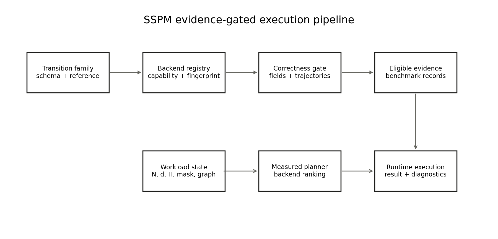
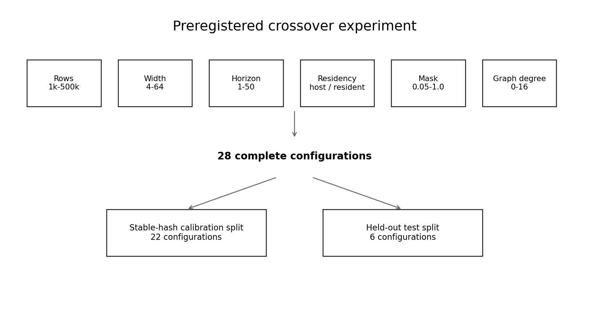
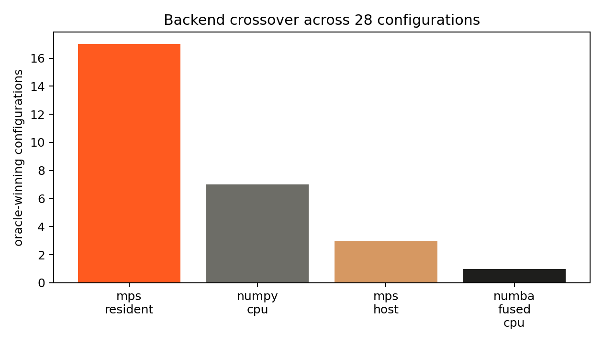
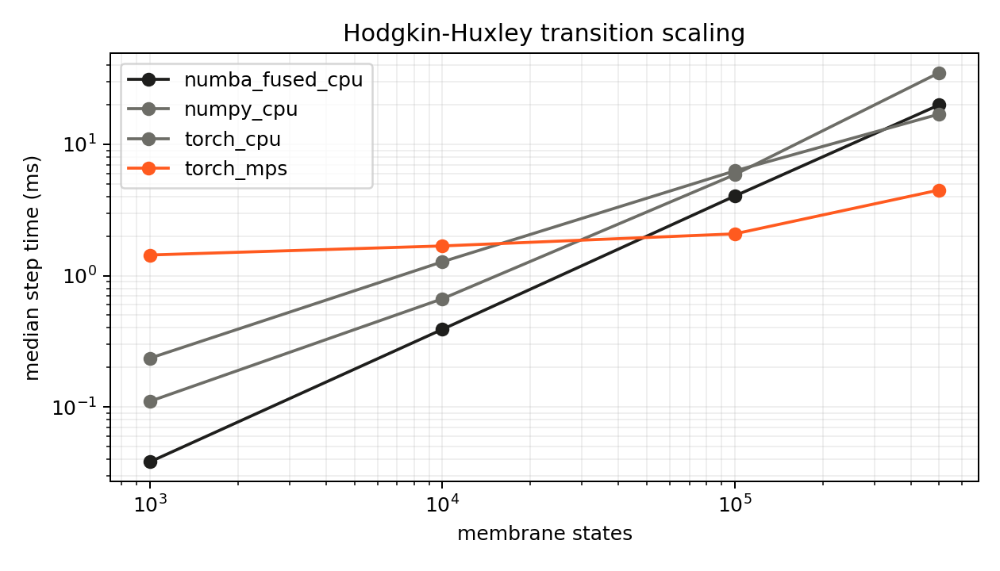

# Abstract

Numerical update programs are often rewritten across scalar code, array libraries, compiled loops, tensor runtimes, and accelerators. Performance comparisons become unreliable when those versions differ in update ordering, thresholds, numerical projection, transfer cost, or state residency. State-Space Programming Methodology (SSPM) is a research framework for making those assumptions explicit before timing begins.

SSPM represents a bounded class of programs as

$$
S_{t+1}=F(S_t,U_t,G_t,\Theta),
$$

where rows are entities, columns are named state variables, $U_t$ contains controls, and optional $G_t$ introduces coupling. A transition family records the state and input schema, update convention, coupling class, numerical bounds, and executable reference. Alternative backends enter measurement only after sampled differential checks.

The current artifact evaluates three families and CPU/MPS execution paths on one Apple M1 Pro. Independent implementations agree over the tested domains. A designed 28-configuration study produces four observed winner modes. A feature-aware planner selects all six held-out winners, but its preregistered median-regret gate ties a fixed MPS policy and is therefore inconclusive. A Hodgkin-Huxley transition using canonical 1952 parameters preserves one-step and 500-step behavior across four backends. The contribution is a disciplined boundary between transition semantics and execution evidence, not a universal compiler or formal verifier.

# Research question

The same transition may appear as an object method, a NumPy expression, a fused compiled loop, a Torch graph, or an accelerator kernel. These forms expose different optimization opportunities, but they can be compared only when they compute the same state update and use a declared timing boundary.

Three recurring failures motivate SSPM:

1. optimization begins before update semantics are frozen;
2. accelerator timing omits conversion or transfer paid by the caller;
3. one backend is declared fastest from a single scale even when residency, horizon, sparsity, or coupling changes the winner.

The governing rule is simple:

> **No semantic equivalence, no speedup claim.**

In the present work, “equivalence” means empirical agreement over declared samples and tolerances. It is not a proof over every possible input.

# Method

## Transition-family records

For $N$ entities, state width $d$, and input width $k$,

$$
S_t\in\mathbb R^{N\times d},\qquad U_t\in\mathbb R^{N\times k}.
$$

A row-local transition has the form

$$
s_{i,t+1}=f(s_{i,t},u_{i,t};\Theta).
$$

A coupled family additionally depends on neighboring state through $G_t$. The distinction is semantic: a graph gather cannot be removed merely because a row-local implementation is faster.

A family record associates each column with a name and intended domain, identifies update ordering and coupling, and fingerprints the structural schema. The fingerprint prevents accidental registration against the wrong family. Numerical comparisons are still required because matching metadata does not establish matching functions.

For backend $b$, sampled domain $\mathcal D$, and tolerance $\epsilon$, the empirical gate checks

$$
\max_{(S,U)\in\mathcal D}\left\|F_b(S,U)-F_{ref}(S,U)\right\|_\infty\leq\epsilon.
$$

Multi-step trajectories are checked separately because small one-step differences can accumulate.

{width=80%}

## Measurement boundary

Total application time can contain preparation, host-to-device transfer, resident execution, device-to-host return, and result materialization:

$$
T=T_{prepare}+T_{H2D}+T_{execute}+T_{D2H}+T_{materialize}.
$$

An accelerator may have the fastest resident kernel while losing an end-to-end call dominated by movement. Conversely, a long resident trajectory can amortize transfer. SSPM therefore carries horizon and residency into the workload description rather than treating row count as the only selection feature.

# Evidence design

## Three transition families

The study uses two synthetic semantic stressors and one source-grounded scientific family.

- **Business transition:** ordered dependencies, thresholds, projections, and updated intermediates. This is a synthetic stressor.
- **Thermal control:** nonlinear controlled state with a different dependency pattern. It is not hardware calibrated.
- **Hodgkin-Huxley 1952:** nonlinear membrane transition with canonical conductances. It supports backend-agreement claims, not biological validation.

## Directed perturbations

Forty-eight structured perturbations cover coefficient, dependency, sign, omission, threshold, ordering, and projection categories. Directed interior, boundary, and threshold cases detect all 48.

This result has a narrow interpretation. Most operators alter the output at declared semantic sites rather than mutating a compiler IR or generated backend implementation. The experiment shows sensitivity to the selected perturbation catalog; it does not establish compiler correctness.

## Backend crossover

The crossover study contains 28 complete configurations varying:

- rows from 1,000 to 500,000;
- state width from 4 to 64;
- horizon from 1 to 50;
- host or resident input state;
- active-mask density from 0.05 to 1.0;
- graph degree from 0 to 16.

A stable hash assigns 22 configurations to calibration and six to held-out evaluation. The primary crossover gate requires at least two observed backend winners. The primary planner gate requires median held-out regret strictly below the best fixed eligible policy.

{width=92%}

# Results

## Semantic agreement

Every reported backend passes its declared family tolerance over the tested samples. The portable C++20 implementation of the business family differs from the Python reference by at most $2.38\times10^{-7}$. For the Hodgkin-Huxley family, the largest observed one-step difference across eligible non-reference backends is $1.24\times10^{-5}$.

These are sampled numerical results. They do not prove equivalence outside the tested domains.

## Workload state changes the winner

Four execution modes become the observed winner across the 28 configurations: resident MPS in 17, NumPy in seven, host MPS in three, and fused Numba in one. The designed crossover gate therefore passes.

The pattern is mechanistically plausible. Small host workloads favor NumPy because setup dominates. Sparse CPU cases can favor fused loops that skip inactive work. Large one-shot arrays can favor host MPS despite transfer, while long resident and graph-coupled trajectories favor resident MPS on the measured machine.

{width=84%}

## Planner result: promising but inconclusive

The feature-aware nearest-neighbor planner selects the observed winner on all six held-out configurations. Its median and 95th-percentile regret are zero. Fixed NumPy and fused Numba have median regret of 5.53 and 3.84 respectively. A feasible fixed MPS policy also has zero median regret because MPS wins five of six held-out cases, but it incurs regret 19.22 on the smallest host case.

The preregistered primary criterion required strict median improvement. The planner ties fixed MPS at zero, so the primary result is **inconclusive**. Perfect six-case selection and better tail behavior are positive secondary observations, not evidence of universal planner superiority.

## Grounded nonlinear transition

The Hodgkin-Huxley family uses voltage and the $m$, $h$, and $n$ gating variables with canonical conductance parameters from the 1952 model. All four eligible backends pass one-step comparison and a 500-step trajectory check. Maximum observed trajectory divergence is $7.63\times10^{-6}$.

At 500,000 membrane states, MPS is the fastest measured one-step path in the frozen local run. At 1,000 states, fused Numba is fastest because accelerator setup dominates. This is another crossover result, not a portable ranking.

{width=88%}

A $0.01$ ms trajectory and a $0.005$ ms comparison differ by at most 0.0077 after 10 ms. This is a limited refinement diagnostic. It is not an order-of-convergence study, a stability proof, or biological validation.

# What is established

The current evidence supports four bounded conclusions:

1. explicit family identity and sampled differential gates make heterogeneous performance comparisons easier to audit;
2. transfer, residency, horizon, sparsity, and coupling can change the fastest execution path;
3. a small feature-aware planner can recover the observed held-out winners in this local experiment, although its primary median gate remains inconclusive;
4. the method transfers from synthetic stressors to one literature-grounded nonlinear transition without losing cross-backend agreement.

The study does **not** establish formal equivalence, arbitrary source lowering, a universal planner, biological accuracy, or performance portability beyond the measured environment.

# Next research gates

The strongest next experiments are methodological rather than cosmetic:

- generate mutations in a restricted source representation or compiler IR;
- enforce declared field dtype, bounds, kind, and finite-value constraints;
- generate lowerings instead of maintaining them manually;
- increase held-out configurations and repeat measurements across independent sessions;
- replicate on x86 and CUDA-class hardware;
- add at least two grounded families, including one with genuine graph coupling;
- measure energy, memory, compilation cost, and concurrent throughput.

SSPM is best understood as a research program at the boundary of applied mathematics, programming systems, and heterogeneous numerical execution. Its current value is not breadth. It is the insistence that semantics, evidence, and timing boundaries remain connected.

# References

1. Hodgkin, A. L., and Huxley, A. F. “A Quantitative Description of Membrane Current and Its Application to Conduction and Excitation in Nerve.” *The Journal of Physiology* 117, 1952. [doi:10.1113/jphysiol.1952.sp004764](https://doi.org/10.1113/jphysiol.1952.sp004764).
2. McKeeman, W. M. “Differential Testing for Software.” *Digital Technical Journal* 10(1), 1998.
3. Pnueli, A., Siegel, M., and Singerman, E. “Translation Validation.” *TACAS*, 1998. [doi:10.1007/BFb0054170](https://doi.org/10.1007/BFb0054170).
4. Jia, Y., and Harman, M. “An Analysis and Survey of the Development of Mutation Testing.” *IEEE Transactions on Software Engineering* 37(5), 2011. [doi:10.1109/TSE.2010.62](https://doi.org/10.1109/TSE.2010.62).
5. Ragan-Kelley, J. et al. “Halide: A Language and Compiler for Optimizing Parallelism, Locality, and Recomputation.” *PLDI*, 2013. [doi:10.1145/2491956.2462176](https://doi.org/10.1145/2491956.2462176).
6. Chen, T. et al. “TVM: An Automated End-to-End Optimizing Compiler for Deep Learning.” *OSDI*, 2018.
7. Lattner, C. et al. “MLIR: Scaling Compiler Infrastructure for Domain Specific Computation.” *CGO*, 2021. [doi:10.1109/CGO51591.2021.9370308](https://doi.org/10.1109/CGO51591.2021.9370308).
8. Williams, S., Waterman, A., and Patterson, D. “Roofline: An Insightful Visual Performance Model for Multicore Architectures.” *Communications of the ACM* 52(4), 2009. [doi:10.1145/1498765.1498785](https://doi.org/10.1145/1498765.1498785).
